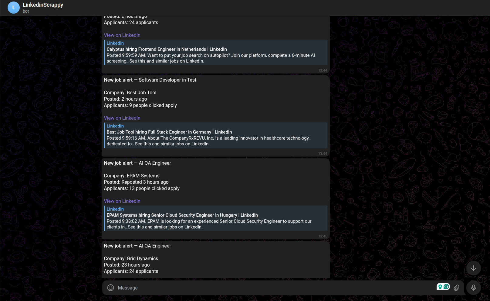

# LinkedIn Job Bot with Telegram Notifications


## Description

Project does one thing: it monitors LinkedIn for new job postings based on specified search criteria and sends notifications about new jobs to a Telegram chat using a bot. It uses a custom-built `linkedin_scraper` package to handle the scraping of LinkedIn data, including authentication and session management.

It consists of two main components:

1. `linkedin_scraper`: A Python package that provides tools to scrape LinkedIn data, including job postings, user profiles, and more. It includes features for handling authentication, managing sessions, and extracting structured data from LinkedIn pages. Original repository is from `joeyism` available [here](https://github.com/joeyism/linkedin_scraper), but it has been modified to support the latest LinkedIn UI changes and to be used as a dependency in this project.
2. `linkedin_jobs_notification`: A sample application that uses the `linkedin_scraper` package to monitor LinkedIn for new job postings based on specified search criteria. It sends notifications about new jobs to a Telegram chat using a bot.

## Demo



## Prerequisites

- Python 3.13+
- [`uv`](https://docs.astral.sh/uv/) package manager
- A LinkedIn account
- A Telegram bot token and chat ID (see [Telegram setup](#how-to-setup-telegram-chat-bot) below)
- Chromium (installed automatically via Playwright)

## One-time setup (per person)

### 1. Create VENV & Install deps

```bash
cd linkedin_jobs_notification
uv venv
uv sync --extra dev
uv run playwright install chromium
```

> **Note:** The only time you'd set up a venv in `linkedin_scraper` is if you want to run its own tests or sample scripts independently.

### 2. Generate session

Run from `linkedin_jobs_notification/` so the session file saves in the right place:

```bash
uv run python ../linkedin_scraper/samples/create_session.py
# browser opens, log in manually -> linkedin_session.json saved here
```

### 3. Config

```bash
cp config.yaml.example config.yaml   # edit your search profiles
cp .env.example .env                 # fill in TELEGRAM_BOT_TOKEN + TELEGRAM_CHAT_ID
```

## Every run

```bash
cd linkedin_jobs_notification
uv run python main.py
```

This will check for new jobs and send Telegram notifications if there are any new matches.

## Optional: run on a schedule (e.g. every 6h)

```bash
# open crontab
crontab -e
# add line (adjust path + timing as needed)
0 */6 * * * cd /path/to/linkedin_jobs_notification && uv run python main.py
```

## How to setup Telegram Chat Bot

1. Find `BotFather` in Telegram and start a chat.
2. Send `/newbot` and follow the instructions to create a new bot. You'll receive a `TELEGRAM_BOT_TOKEN`.
3. To get your `TELEGRAM_CHAT_ID`, start a chat with your bot and send any message. Then visit:
   ```
   https://api.telegram.org/bot<TELEGRAM_BOT_TOKEN>/getUpdates
   ```
   Look for the `chat` object in the JSON response — the `id` field is your `TELEGRAM_CHAT_ID`.

## License

This project uses a dual license:

- **`linkedin_jobs_notification/`** — original code by Martin Stajnko, licensed under the [MIT License](LICENSE).
- **`linkedin_scraper/`** — derived from [joeyism/linkedin_scraper](https://github.com/joeyism/linkedin_scraper), licensed under the [GNU General Public License v3.0](linkedin_scraper/LICENSE). Modifications were made to support the latest LinkedIn UI and to integrate with this project.

> **Note:** The `linkedin_scraper` README incorrectly states Apache 2.0 — the actual governing license (as confirmed by the LICENSE file and GitHub) is GPL-3.0.
